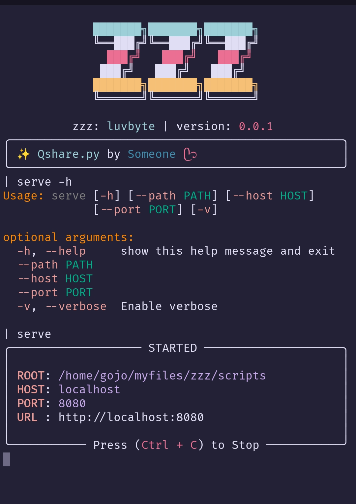

# zzz 💤  
A lightweight framework for building interactive Python scripts

`zzz` is a Python package built on top of [`cmd2`](https://cmd2.readthedocs.io) that makes it easy to build interactive, command-driven Python programs.  
It gives you a simple API for defining commands, handling user input, and extending functionality — perfect for creating REPL-like tools, admin shells, or prototypes.



---

## ✨ Features

- Simple API to create interactive command-line applications  
- Built on `cmd2` for history, tab completion, transcripts, and more  
- Minimal setup — just subclass and add commands  
- Great for prototypes, admin utilities, or sharing interactive tools  

---

## 📦 Installation

```bash
pip install zzz
```

(or clone and install locally:)
```bash
git clone https://github.com/luvbyte/zzz.git
cd zzz
pip install .
```
---
## ⚡ Why zzz?

Save time — skip boilerplate when building interactive shells

Enjoy rich features from cmd2 without the setup

Create professional-feeling CLI tools quickly

